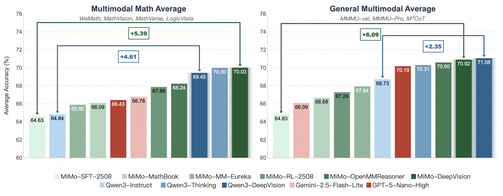
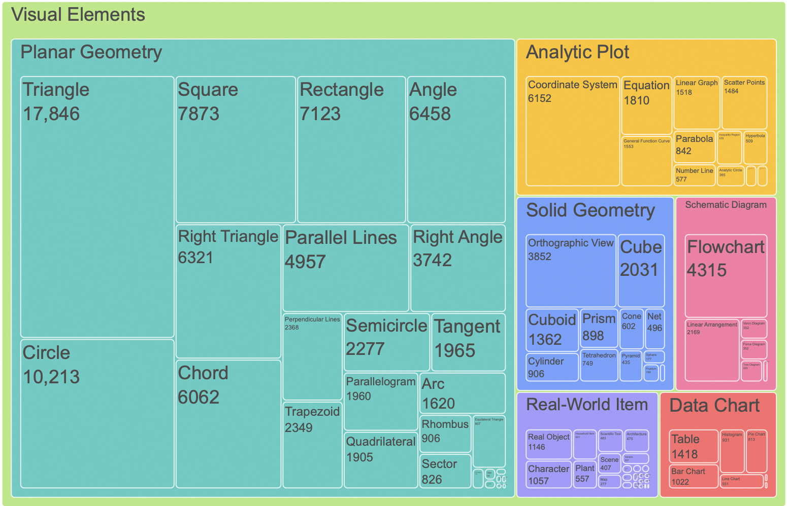
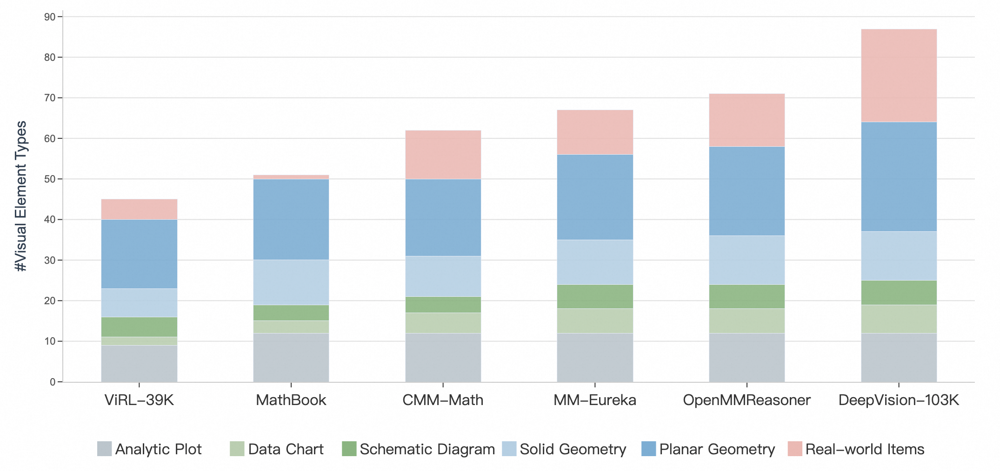
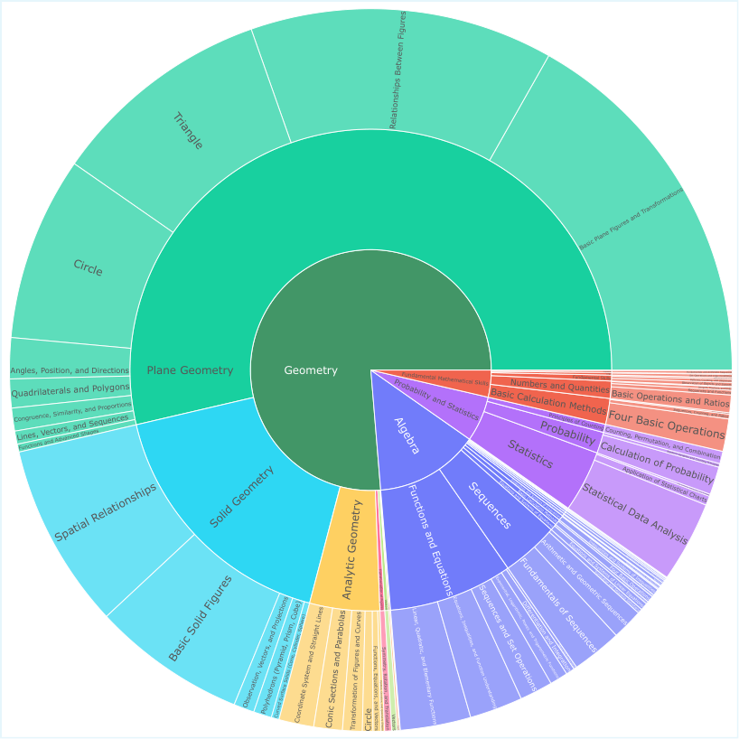
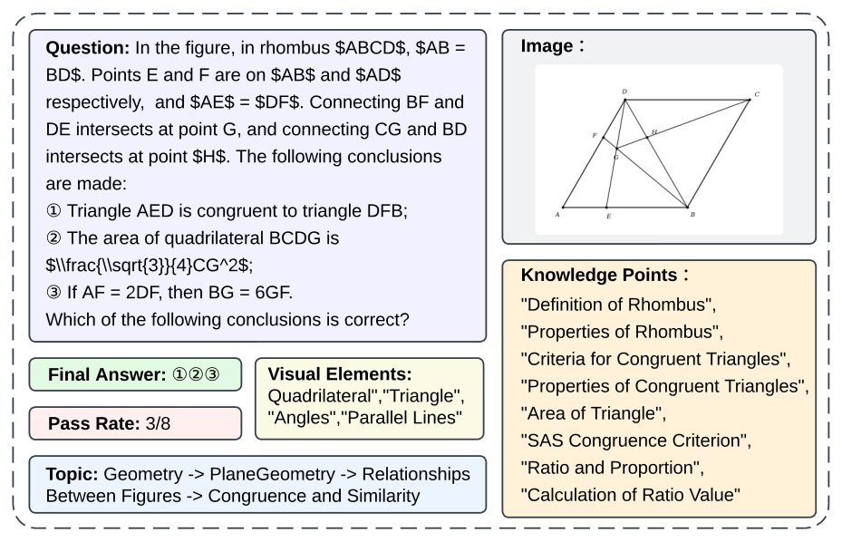
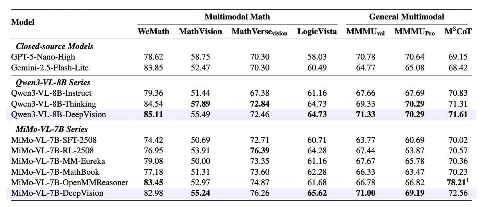

<div align="center">

# 🔭 DeepVision-103K

<div>
A Visually Diverse, Broad-Coverage, and Verifiable Mathematical Dataset for Multimodal Reasoning
</div>
</div>

<div>
<br>

<div align="center">

[](https://huggingface.co/datasets/ORG/DeepVision-103K)
[](https://github.com/SKYLENAGE-AI/DeepVision-103K)
<!-- [](https://arxiv.org/abs/xxxx.xxxxx) -->

</div>
</div>

Training on DeepVision-103K yields **top performance** on both multimodal mathematical reasoning and general multimodal benchmarks:

<div align="center"> 

<sub>Average Performance on multimodal math and general multimodal benchmarks.</sub> </div>

## 📢 News

- **Feb 16, 2026**: We release **`DeepVision-103K`**, a large-scale, visually diverse, and verifiable multimodal mathematical dataset for advancing multimodal reasoning via RLVR. 

## 📦 Resource

- 🧩 Training data: [`DeepVision-103K`](https://huggingface.co/datasets/skylenage/DeepVision-103K)
- 💻 Code: [`DeepVision-103K`](https://github.com/SKYLENAGE-AI/DeepVision-103K)
<!-- - 📄 Paper: [`arXiv:xxxx.xxxxx`](https://arxiv.org/abs/xxxx.xxxxx) -->

## 📝 Overview

**`DeepVision-103K`** is a dataset designed for LMM Reasoning, curated from diverse real-world K12 educational sources. Key features include:

**1. Visual Diversity**: DeepVision-103K covers planar geometry, solid geometry, analytic plots, data charts, schematic diagrams, and real-world items in mathematical contexts. 
<div align="center"> 
<sub>Visual elements in DeepVision-103K</sub> </div>

Within each category, DeepVision offers richer element types than existing open-source datasets.
<div align="center"> 
<sub>The number of different visual element types across training datasets.</sub> </div>

**2. Broad Coverage**: DeepVision-103K spans  Geometry, Algebra, Probability & Statistics, and Fundamental Mathematical Skills.

<div align="center"> 

<sub>Hierarchical breakdown of mathematical topics covered in DeepVision-103K.</sub> </div>

**3. Rich Data Format**: Each sample contains structured annotations to support various downstream tasks:

<div align="center"> 

<sub>A data sample from DeepVision-103K.</sub> </div>

- **Question & Image**: Problem statement and corresponding image.
- **Final Answer**: A unique, verifiable answer enabling rule-based reward computation in RLVR.
- **Pass Rate**: The proportion of correct responses obtained during model rollouts.
- **Topic**: Hierarchical classification of the mathematical branch.
- **Knowledge Points**: Specific mathematical concepts, theorems, or techniques required.
- **Visual Elements**: Geometric or graphical objects depicted in the image.


## Curation Pipeline
A three-stage pipeline transforms diverse but noisy real-world K12 problems into structured and verifiable QA pairs:
- **Validity Filtering**: Remove problems unsuitable for RL (proof-based, descriptive, multi-answer questions).
- **Difficulty Filtering**: Calibrate sample difficulty via model rollout pass rates.
- **Query Correctness Verification**: Validate image-question pairs and answers using Gemini-3-Flash.

<div align="center"> 

<sub>Curation pipeline for mathematical data in DeepVision-103K.</sub> </div>

## 📊 Main Results
Training on DeepVision-103K yields **top performance** on both multimodal mathematical reasoning and general multimodal benchmarks:
<div align="center"> 
<sub>Average Performance on multimodal math and general multimodal benchmarks.</sub> </div>
<div align="center"> 

<sub>Specific Performance on multimodal math and general multimodal benchmarks.</sub> </div>


## DeepVision-103k Training & Evaluation Toolkit

We use [GSPO](https://arxiv.org/abs/2507.18071) for training and [vllm](https://github.com/vllm-project/vllm) for async batch evaluation. The training code is built on top of [verl](https://github.com/volcengine/verl). We use [swanlab](https://github.com/SwanHubX/SwanLab) for experiment tracking.


<!-- ### Code Structure

```
.
├── verl/                    # Core verl library (install via pip install -e .)
├── train_scripts/           # Training launch scripts
│   ├── train_single_node_template.sh   # Single-node training
│   └── train_multi_node_template.sh    # Multi-node training (Ray cluster)
├── eval_scripts/            # Evaluation / inference scripts
│   ├── caller_async.py      # Orchestrator: launches vLLM servers + dispatches inference
│   ├── infer-v6.py          # Async continuous-batching inference client
│   └── caller.sh            # Example launch script
├── setup.py
├── pyproject.toml
└── requirements.txt
``` -->

### Installation
#### Recommended Environment
We recommend the following environment configuration:
- CUDA 12.8
- PyTorch 2.8.0
- vLLM 0.11.0
- Transformers 4.57.1

#### Setup Steps
```bash
# Clone the repo
git clone https://github.com/SKYLENAGE-AI/DeepVision-103K && cd DeepVision-103K

# Install mathverify for rule-based verification
pip install mathverify

# Install qwen_vl_utils for model training
pip install qwen_vl_utils

# Install verl in editable mode
pip install -e .
```
---

### Training

Two training templates are provided under `train_scripts/`. Both use the GSPO algorithm with GRPO advantage estimation.

#### Quick Start

1. **Search for `{YOUR_`** in the script to find all placeholders that need to be filled in:

| Placeholder | Description |
|---|---|
| `{YOUR_SWANLAB_API_KEY}` | Your SwanLab API key (for experiment tracking) |
| `{YOUR_PROJECT_NAME}` | Project name for experiment grouping |
| `{YOUR_BASE_MODEL}` | Base model identifier (used in experiment naming) |
| `{YOUR_ROOT_PATH}` | Root directory for saving checkpoints |
| `{YOUR_MODEL_PATH}` | Path to the pretrained model (e.g. HuggingFace format) |
| `{YOUR_TRAIN_FILE}` | Path to training data (`.parquet` format) |
| `{YOUR_TEST_FILE}` | Path to validation data (`.parquet` format) |

2. **Uncomment the GPU setting block** that matches your cluster size (8 / 16 / 32 / 64 GPUs).

3. **Run the script.**

#### Single-Node Training (8/16 GPUs on one machine)

```bash
bash train_scripts/train_single_node_template.sh
```


#### Multi-Node Training (Ray cluster across multiple machines)

```bash
# Submit to each node via your job scheduler
# Environment variables RANK, WORLD_SIZE, MASTER_ADDR must be set by the scheduler
bash train_scripts/train_multi_node_template.sh
```

### Evaluation 

The evaluation pipeline under `eval_scripts/` provides inference and evaluation scripts.

#### Inference

1. **Fill in placeholders** in `caller.sh`:

```bash
python caller_async.py \
    --model /path/to/your/model \
    --input /path/to/input.jsonl \
    --output /path/to/output.jsonl \
    --hyperparam mimo \
    --prompt-field prompt \
    --gpu-devices "0,1,2,3,4,5,6,7" \
    --tensor-parallel-size 1 \
    --data-parallel-size 8 \
    --concurrent-per-endpoint 16 \
    --max-tokens 16384 \
    --n 8
```

2. **Run:**

```bash
cd eval_scripts
bash caller.sh
```

### Post-Inference Evaluation

After inference is complete, use the evaluation tools under `eval_scripts/evaluation/` to score and analyze results.

#### Step 1: Math-Verify Rule-Based Evaluation

Run the math-verify judge to compute accuracy and automatically export error cases:

```bash
python eval_scripts/evaluation/mathverify_judge.py -i /path/to/your_output.jsonl
```

This will:

- Print overall accuracy statistics (correct / wrong / error counts)
- Save a detailed evaluation summary to `your_output_evaluation.json`
- Export all incorrect cases to `your_output_mathverify_error.jsonl`


#### Step 2: GPT-5-mini Re-Judge on Error Cases

For the exported error cases (`*_mathverify_error.jsonl`), use GPT-5-mini as a secondary judge to catch false negatives from rule-based matching.

The judge prompt template is defined in `eval_scripts/evaluation/gpt5-mini-judge_prompt.md`. For each error case, construct the prompt by filling in the template:

```
PlainTextQuestion: {question}
Standard Answer:{gdt}
Model Answer:{box_answer}   # extracted \boxed{} content
```

Call GPT-5-mini with this prompt. The model will reply with exactly one word: **"Correct"** or **"Incorrect"**.

Cases marked **"Correct"** by GPT-5-mini are false negatives from math-verify and should be added back to the correct count for the final accuracy.


## 📖 Citation

Our paper will be released soon.

## 🙏 Acknowledgements

This work builds upon the following resources:

- **[MM-MathInstruct-3M](https://huggingface.co/datasets/MathLLMs/MM-MathInstruct)**: Large-scale multimodal math instruction data from real educational contexts.
- **[MultiMath-300K](https://huggingface.co/datasets/pengshuai-rin/multimath-300k)**: Multimodal mathematical dataset from real educational contexts.
- **[Zebra-CoT](https://huggingface.co/datasets/multimodal-reasoning-lab/Zebra-CoT)**: Visual logic reasoning problems.
- **[GameQA](https://huggingface.co/datasets/OpenMOSS-Team/GameQA-140K)**: Game-based visual reasoning tasks.
